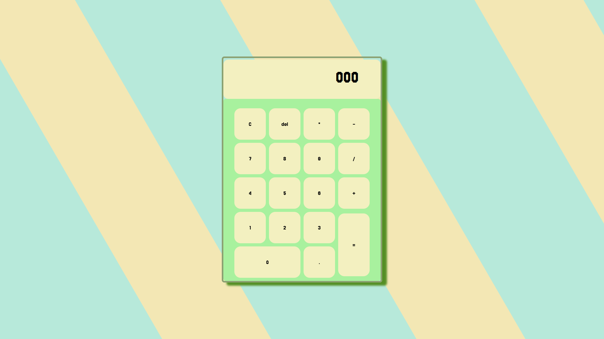

# Basic Calculator
A simple calculator web page with **HTML**, **CSS**, and **JavaScript**(not properly implemented).

---
## Features

- Designed using CSS Grid and custom fonts.
- Basic arithmetic operations: addition, subtraction, multiplication, and division.
- Supports calculations involving **two numbers only**.

---

## Demo

---

## Tools Used

- **HTML**: Structure of the calculator.
- **CSS**: Styling and layout using CSS Grid and custom properties.
- **JavaScript**: Calculator logic (limited to two numbers operations).

---

## Limitations

- The JavaScript logic only supports calculations involving **two numbers** at a time. 

---
